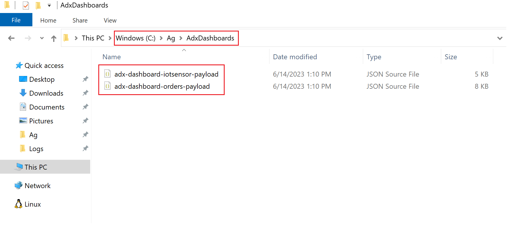
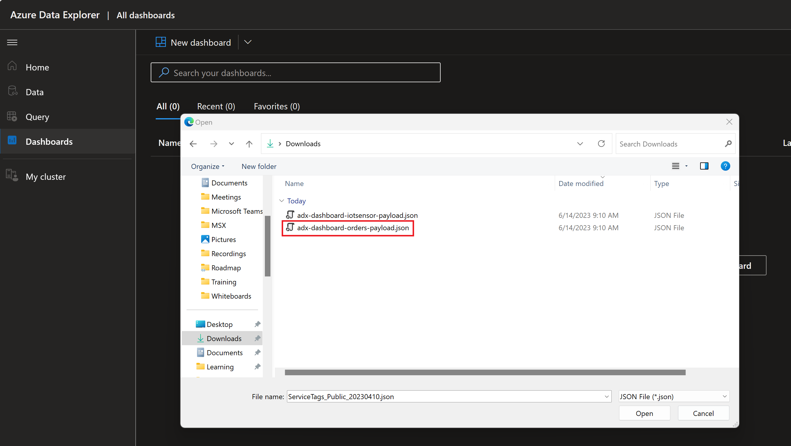
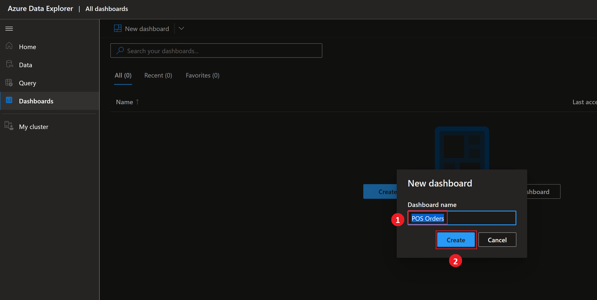
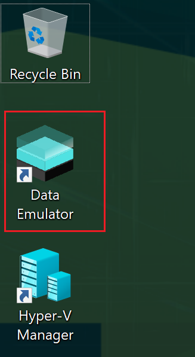
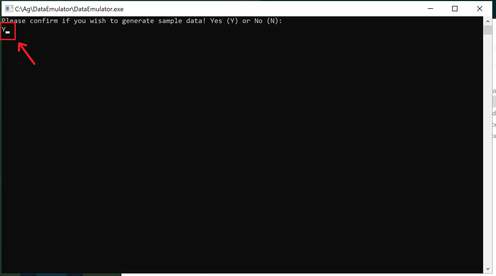
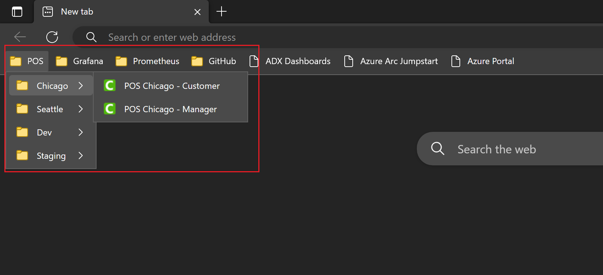
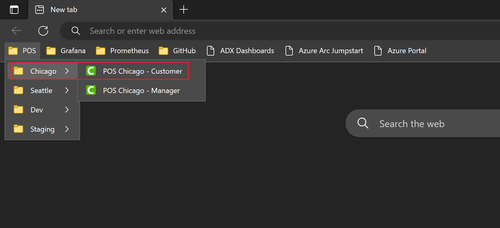
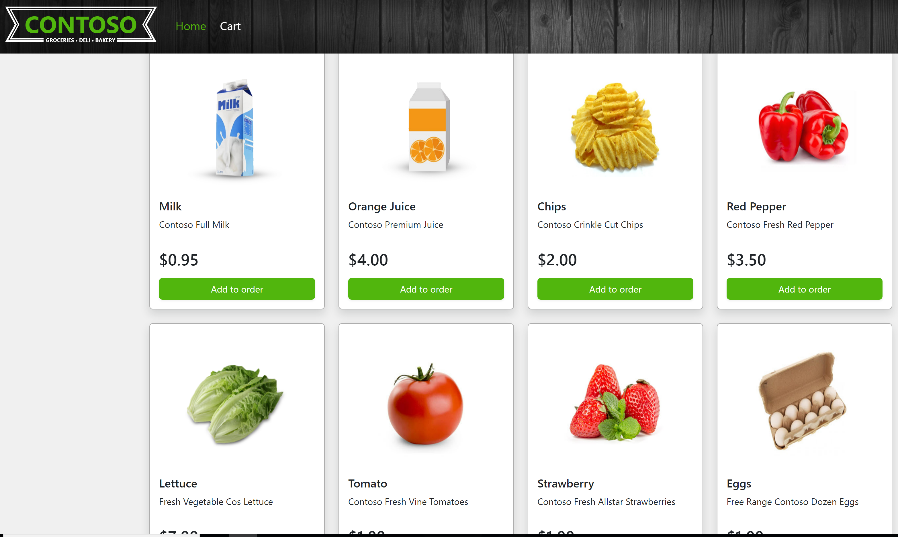
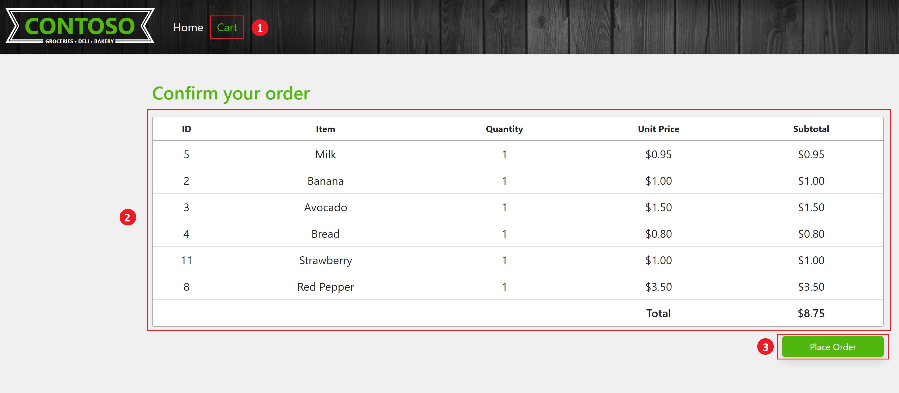
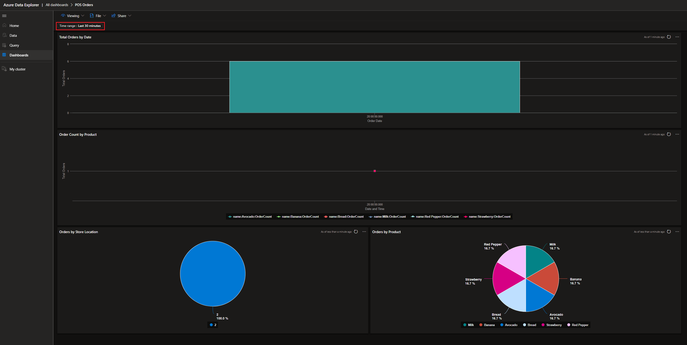

# Contoso Supermarket data pipeline and reporting across cloud and edge - Store orders

One of Contoso's biggest objectives is how to use the data coming from their stores and visualize it for business intelligence by leveraging the power of the cloud.

In this scenario, Contoso wants to use their data pipeline so customer orders placed in the Point of Sale (PoS) application on the various supermarket stores, flow to [Azure Data Explorer (ADX)](https://learn.microsoft.com/azure/data-explorer/data-explorer-overview) database and generate near real-time reports. By doing so, Contoso management can leverage these reports to adjust their inventory and supply chain based on the product demand from customer orders across multiple filters - stores, day, week, month, and year. This helps optimize Contoso resources, stores supplies, saves significant costs and at the same time improves customer satisfaction and trust.

## Architecture

Below is an architecture diagram that shows how the data flows from the PoS application and into the ADX database to generate near real-time reports of orders received and processed across various supermarket store locations. This architecture includes a local PostgreSQL database running at the edge in the store, [Azure Cosmos DB](https://learn.microsoft.com/azure/cosmos-db/introduction) and ADX cluster in Azure cloud, and a Cloud Sync service that moves orders data from edge location to Cosmos DB in the cloud.

## PoS dashboard reports

Contoso supports dashboard reports for the PoS application analytics and monitoring. These reports are created in ADX to allow users to view dashboards reports. These reports are generated based on live data received from the PoS application into the ADX database using data integration.

## Manually import dashboards

> **Note:** If you used the [Azure Developer CLI (azd) method](https://github.com/microsoft/azure_arc/blob/jumpstart_ag/docs/azure_jumpstart_ag/contoso_supermarket/deployment/_index.md#deployment-via-azure-developer-cli-experimental) to deploy the Contoso Supermarket scenario, you may skip this section as these reports are automatically imported for you during the deployment.

Follow the below steps in order to view the PoS Orders dashboard reports you will need to import these into ADX.

- On the Client VM, open Windows Explorer and navigate to folder _C:\Ag\adx_dashboards_ folder. This folder contains two ADX dashboard report JSON files (_adx-dashboard-iotsensor-payload.json_ and _adx-dashboard-orders-payload.json_) with the ADX name and URI updated when the deployment PowerShell logon script is completed.

  

- Copy these ADX dashboards report JSON files on your computer in a temporary folder to import into ADX dashboards. Alternatively, you can log in to ADX Dashboards directly on the Client VM.

  > **Note:** Depending the account being used to log in to ADX portal, Azure AD tenant of that account may have conditional access policies enabled and might prevent log in to ADX Dashboards from the Client VM as this VM is not managed by your organization.

- On your computer open browser of your choice or on the Client VM open Edge browser and log in to [ADX Dashboards](https://dataexplorer.azure.com/). Use the same user account that you deployed Jumpstart Agora in your subscription. Failure to use the same account will prevent access to the ADX Orders database to generate reports.

- Once you log in to ADX dashboards, click on Dashboards in the left navigation to import PoS Orders dashboard report.

  

- Select _Import dashboard from file_ to select previously copied file from the Client VM or _C:\Ag\adx_dashboards_ folder on the Client VM.

  

- Choose _adx-dashboard-orders-payload.json_ file to import.

  

- Confirm dashboard report name, accept the suggested name or chose your own name and click _Create_.

  

- By default, there is no data available in the ADX Orders database to display in the report after deployment. Click Save to save the dashboard report in ADX.

  

## Generate sample data using Data Emulator

By default there is no data available in Cosmos DB database after the deployment is complete. There are two ways you can generate Orders data. One method is using PoS application and place orders. Another option is by using Data Emulator tool available on the Agora client VM. Use instructions below to generate sample data using the Data Emulator tool.

- On the Client VM, locate Data Emulator icon on the desktop.

  

- Double click on the Data Emulator desktop icon to launch executable and generate sample data. Confirm by entering **Yes** or **Y** to start generating data, entering No or N will exit the tool. This tool generates data for the last 30 days. Say No or N to prevent regenerating sample data if it is generated earlier.

  > **Note**: You can still generate additional sample data by running this tool multiple times, but there might be duplicate key errors and fails to generate data in subsequent attempts.

  

  

- From ADX open PoS Orders report to see newly simulated orders data. Allow some time to propagate data into the ADX database using an integrated data pipeline.

  

- By default report displays for the last one hour data. To change report time range, chose time range as last 30 days from the report to refresh and display for the selected time range.

  

  

### Generate orders from Contoso Supermarket store applications

- On the Agora client VM, open Edge browser. From the favorites bar review bookmarks created for PoS applications for different stores and environments.

  

- From the bookmarks expand POS -> Chicago and select "POS Chicago - Customer".

  

- Randomly add a few items to the cart.

  

- Click on Cart, review items, and click Place Order.

  

- Place multiple orders by adding random items to the cart.

- Go to ADX portal, under Dashboards open PoS Orders report and chose time range for last 30 minutes. Some times it takes time to flow orders to Azure Data Explore wait for few minutes and refresh report to see data.

  

- From Edge browser bookmarks, open the PoS application for other stores and repeat the order processing and see the PoS Orders dashboard for multiple stores and environments.

  

## Next steps

Use the following guides to explore different use cases of Contoso Supermarket in Jumpstart Agora.

- [PoS](https://placeholder)
- [Freezer Monitor](https://placeholder)
- [CI/CD](https://placeholder)
- [Basic GitOps](https://placeholder)
- [Analytics](https://analytics)
- [Troubleshooting](https://troubleshooting)
