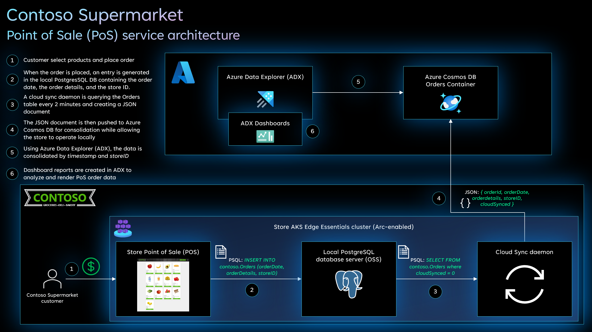
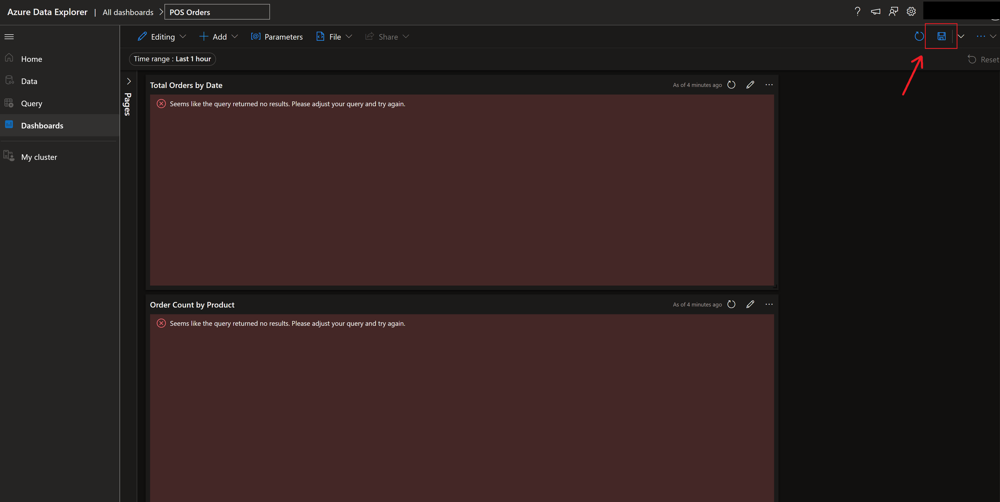
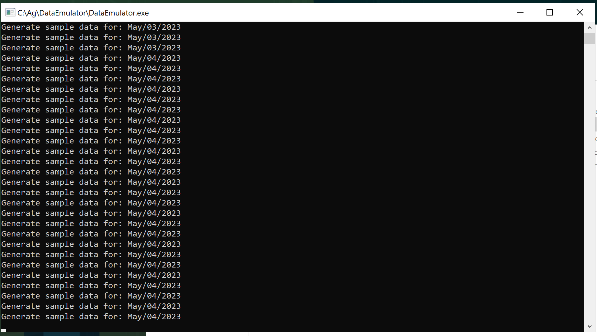
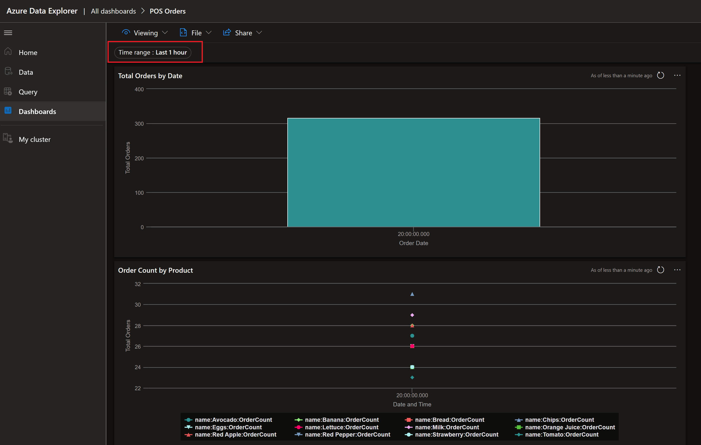
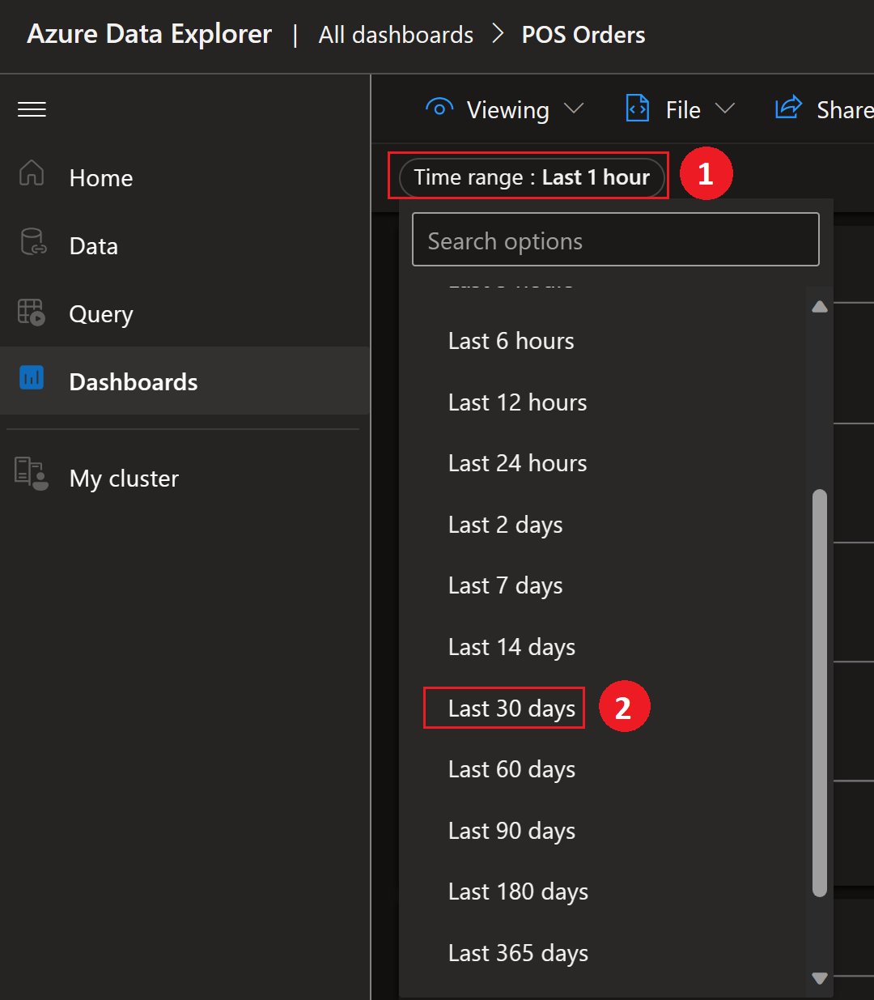
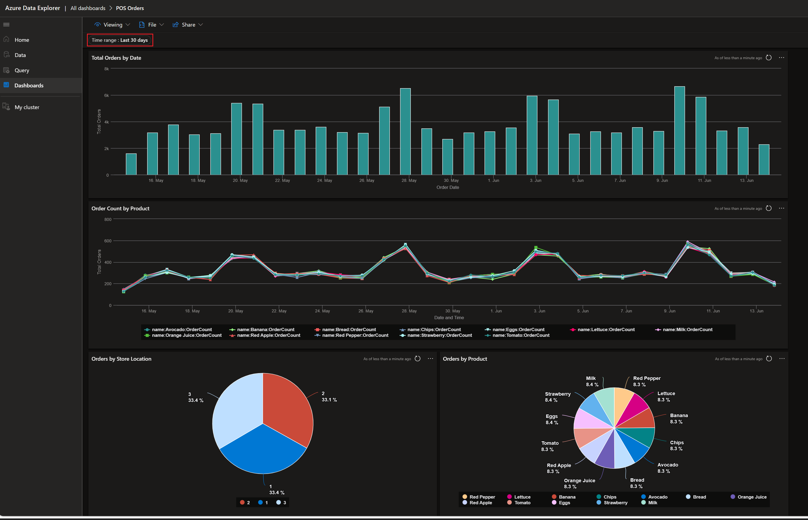

# Contoso Supermarket data pipeline and reporting across cloud and edge - Store orders

If you are on this page, by now you may have the familiarity of Contoso Supermarket, its objectives, and goals. As part of the series of various technology stack demonstration scenarios, this scenario covers the data pipeline and reporting across various Contoso Supermarket stores and services to showcase how the Point of Sale (PoS) order data flows to Azure Data Explorer (ADX) database and generate near realtime reports. Contoso management can leverage these reports to adjust their inventory and supply chain based on the product demand from customer orders across stores, day, week, month, and year. This helps optimize Contoso resources, store capacity, and saves significant cost and at the same time improves customer satisfaction and trust.

## Architecture

Below is an architecture diagram that shows how the data flows from the PoS application and into the ADX database to generate near real-time reports of orders received and processed across various supermarket store locations. This architecture includes a local PostgreSQL database running at the edge in the store, [Azure Cosmos DB](https://learn.microsoft.com/azure/cosmos-db/introduction) and ADX cluster in Azure cloud, and a Cloud Sync service that moves orders data from edge location to Cosmos DB in the cloud.

## PoS dashboard reports

Contoso supports dashboard reports for the PoS application and Internet of Things (IoT) environment sensor analytics and monitoring. These reports are created in ADX to allow users to view dashboards reports. These reports are generated based on live data received from the PoS application and IoT environment sensors into the ADX database using data integration.

## Manually import dashboards

> **Note:** If you used the [Azure Developer CLI (azd) method](https://github.com/microsoft/azure_arc/blob/jumpstart_ag/docs/azure_jumpstart_ag/contoso_supermarket/deployment/_index.md#deployment-via-azure-developer-cli-experimental) to deploy the Contoso Supermarket scenario, you may skip this section as these reports are automatically imported for you during the deployment.

In order to view PoS Order dashboard reports you need to import these dashboards into ADX. You should have completed deployment of Jumptstart Agora in your environment and logon script is completed after you first login to Client VM _Ag-VM-Client_. Follow the step below to import dashboards once all the pre-requisites are completed.

- On the Client VM, open Windows Explorer and navigate to folder _C:\Ag\adx_dashboards_ folder. This folder contains two ADX dashboard report JSON files (_adx-dashboard-iotsensor-payload.json_ and _adx-dashboard-orders-payload.json_) with ADX name and URI updated when the logon script is completed.

  

- Copy these ADX dashboard report JSON files on your computer in a temporary folder to import into ADX dashboards. Alternatively you can login to ADX Dashboards directly on the Client VM. Your Azure AD tenant may have conditional access policies enabled and might prevent login to ADX Dashboards from the Client VM as these VM is not managed by your organization.

- On your computer or Client VM open Edge browser and login to [ADX Dashboards](https://dataexplorer.azure.com/). Use the same user account that you deployed Jumpstart Agora in your subscription. Failure to use same account will prevent access to the ADX Orders database to generate reports.

- Once you login to ADX dashboards, click on Dashboards in the left navigation and review existing reports. You may or may not have existing reports.

  

- Click import dashboard file to select previously copied file from the Client VM or _C:\Ag\adx_dashboards_ folder on the Client VM.

  

- Choose _adx-dashboard-orders-payload.json_ file to import.

  

- Confirm dashboard report name, accept the suggested name or chose your own name and click Create.

  

- By default there is no data available in the ADX Orders database to display report after deployment. Click Save to save dashboard report in ADX.

  

- Repeat above steps to import Freezer Monitoring dashboard report using _adx-dashboard-iotsensor-payload.json_ template file.

  

- Freezer monitoring IoT sensors continuously send data to ADX database after the deployment is completed and will see data in the Freezer Monitoring dashboard report.

## Generate sample data using Data Emulator

By default there is no data available in Cosmos DB database after the deployment is complete. There are two ways you can generate Orders data. One method is using PoS application and place orders. Another option is by using Data Emulator tool available on the Agora client VM. Use instructions below to generate sample data using the Data Emulator tool.

- On the Client VM **Ag-VM-Client**, locate Data Emulator icon on the desktop.

  

- Double click on the Data Emulator desktop icon to launch executable and generate sample data. Confirm by entering **Yes** or **Y** to start generating data, entering No or N will exit the tool. This tool generates data for the last 30 days. Say No or N to prevent regenerating sample data if it is generated earlier. You can still generate additional sample data. Please note, there might be duplicate key errors and might fail to generate data in subsequent attempts.

  

  

- From ADX open PoS Orders report to see newly simulated orders data. Allow some time to propagate data into ADX database using integrated data pipeline.

  

- By default report displays for the last one hour data. To change report time range, chose time range as last 30 days from the report to refresh and display for the selected time range.

  

  

## Generate orders from Contoso Supermarket store applications

- On the Agora client VM **Ag-VM-Client**, open Edge browser. From the favorites bar review bookmarks created for PoS applications for different stores and environments.

  

- From the bookmarks expand POS -> Chicago and select POS Chicago - Customer application.

  

- Randomly add few items to the cart.

  

- Click on Cart, review items in the cart, and click Place Order.

  

- Place multiple orders by adding random items to the cart.

- Go to ADX Portal, under Dashboards open PoS Orders report and chose time range for last 30 minutes. Some times it takes time to flow orders to Azure Data Explore wait for few minutes and refresh report to see data.

  

- From Edge browser bookmarks, open PoS application for other stores and repeat the order processing and see PoS Orders dashboard for multiple stores and environments.

  

## Next steps

Use the following guides to explore different use cases of Contoso Supermarket in Jumpstart Agora.

- [PoS](https://placeholder)
- [Freezer Monitor](https://placeholder)
- [CI/CD](https://placeholder)
- [Basic GitOps](https://placeholder)
- [Analytics](https://analytics)
- [Troubleshooting](https://troubleshooting)
