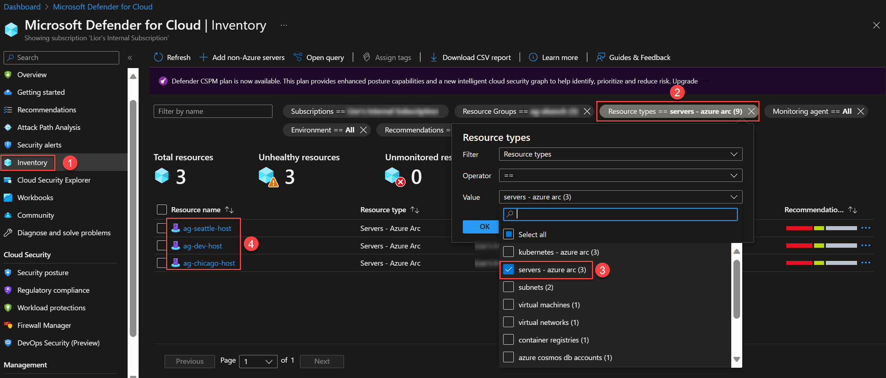

# Infrastructure security with Microsoft Defender for Servers

Microsoft Defender for Cloud provides unified security management and threat protection across your hybrid and multi-cloud workloads. To get all of the Microsoft Defender for Servers protections, you will need to enable the Microsoft Defender for Servers plan at subscription level.

## Onboarding

Follow these steps to enable the plan in the case it is not already enabled:

- Login to AZ CLI using the ```az login``` command.

- Ensure that you have selected the correct subscription you want to deploy ArcBox to by using the ```az account list --query "[?isDefault]"``` command. If you need to adjust the active subscription used by Az CLI, follow [this guidance](https://docs.microsoft.com/cli/azure/manage-azure-subscriptions-azure-cli#change-the-active-subscription).

- Run the following command to check whether Microsoft Defender for Servers is already enabled in your subscription or not:

    ```shell
    az security pricing show -n VirtualMachines
    ```

    

    > **NOTE: Proceed with the next step if the value you have got for _pricingTier_ is equals to _Free_. If the value was _Standard_, Microsoft Defender for Servers is already enabled and no additional action is required.**

- Run the following command to enable Microsoft Defender for Servers in your subscription:

    ```shell
    az security pricing create -n VirtualMachines --tier 'standard'
    ```

    

    > **NOTE: Remember to follow the steps provided in the Cleanup section to disable Microsoft Defender for Servers.**

## Cleanup

> **NOTE: Proceed with the next steps if Microsoft Defender for Servers in your subscription was set to _Free_.**

- Login to AZ CLI using the ```az login``` command.

- Ensure that you have selected the correct subscription you want to deploy ArcBox to by using the ```az account list --query "[?isDefault]"``` command. If you need to adjust the active subscription used by Az CLI, follow [this guidance](https://docs.microsoft.com/cli/azure/manage-azure-subscriptions-azure-cli#change-the-active-subscription).

- Run the following command to disable Microsoft Defender for Servers in your subscription:

    ```shell
    az security pricing create -n VirtualMachines --tier 'free'
    ```

    
