## Jumpstart Agora - Deployment guide

Jumpstart Agora provides a simple deployment process using Azure Bicep and PowerShell that minimizes user interaction. This automation automatically configures the Contoso Supermarket scenario environment, including the infrastructure, the Contoso-Supermarket applications, CI/CD artifacts, and observability components. The diagram below details the high-level architecture that is deployed and configured as part of the automation.

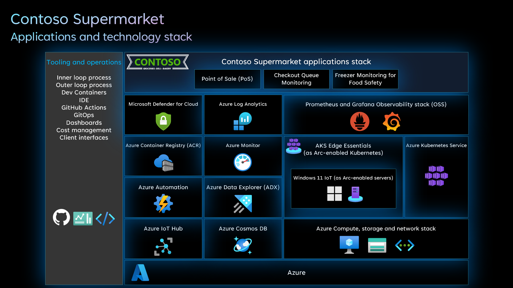

Deploying Agora consists of the following steps (once prerequisites are met).
  
  1. Deploy infrastructure - User deploys a Bicep file that creates the infrastructure in an Azure resource group.
  2. Bicep template deploys multiple Azure resources including the Client virtual machine.
  3. Client VM uses custom script extension to run the Bootstrap PowerShell script which initializes the environment.
  4. Bootstrap script injects the Logon script to Client VM.
  5. User logs in to the Agora-VM-Client Azure virtual machine.
  6. After login the Agora-VM-Client PowerShell scripts automatically run that configure the applications and CI/CD. These scripts will take some time to run.

Once automation is complete, users can immediately start enjoying the Contoso Supermarket experience.

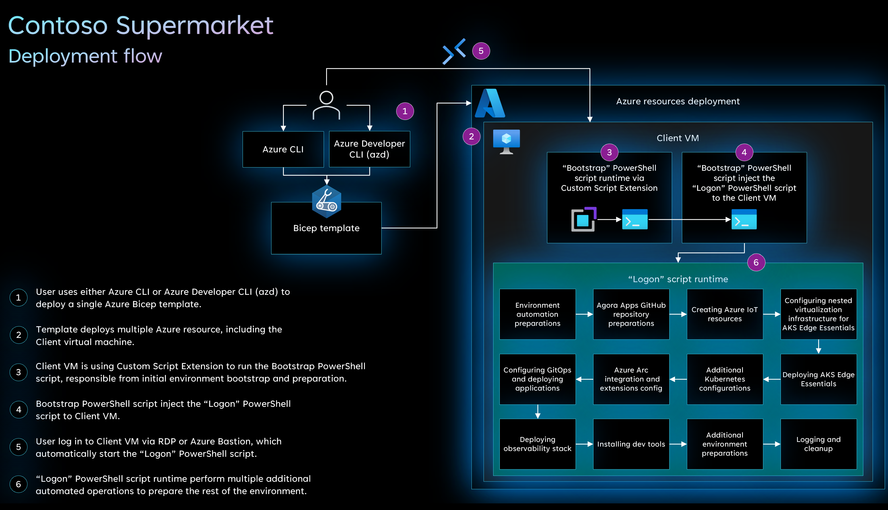

## Prerequisites

- Fork the [_Jumpstart-Agora-Apps_ repo](https://github.com/microsoft/jumpstart-agora-apps) into your own GitHub account. If you do not have a GitHub account, visit [this link](https://github.com/join) to create one.

  - Open the [_Jumpstart-Agora-Apps_ repo](https://github.com/microsoft/jumpstart-agora-apps) while signed into your GitHub account and click the "Fork" button in the upper-right corner.

    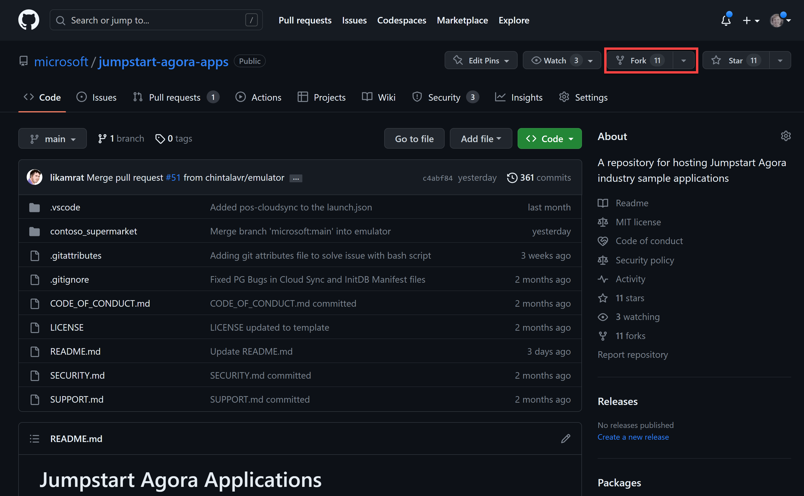
  
  - Use the default settings to create your fork. Ensure that your user is selected in the dropdown and then click the "Create Fork" button.

    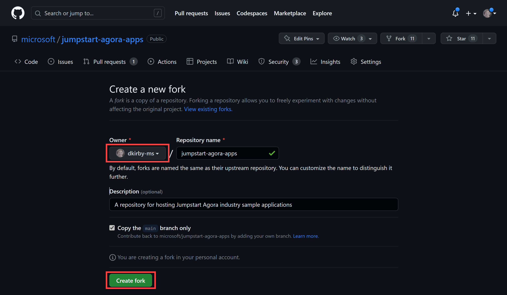

- Configure a GitHub fine-grained personal access token (PAT) with permissions to modify *only* the Jumpstart Agora Apps repo that you forked.

  - In the top right of the GitHub website, click on the dropdown on your user icon and then click "Settings".

    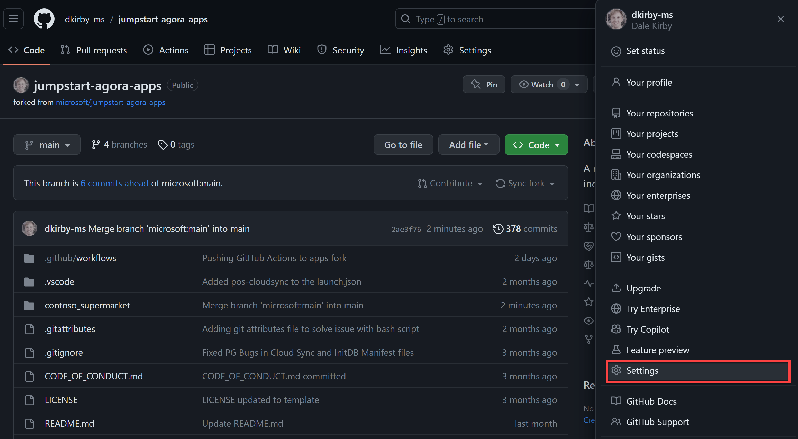

  - In the left menu navigation click on "Developer settings".

    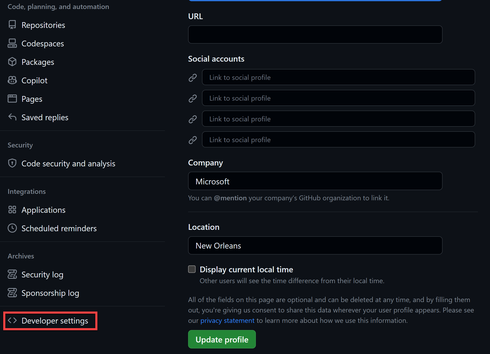

  - Under "Personal access tokens" select "Fine-grained tokens".

    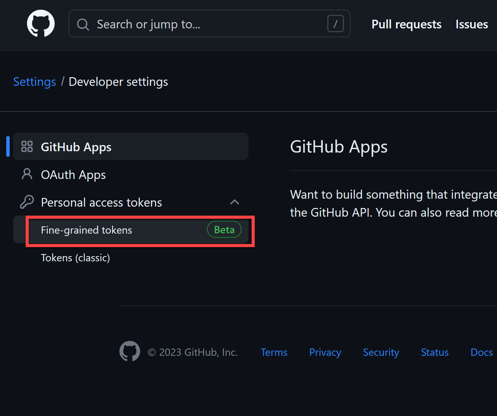

    

  - Give your token a name and select an expiry period.

    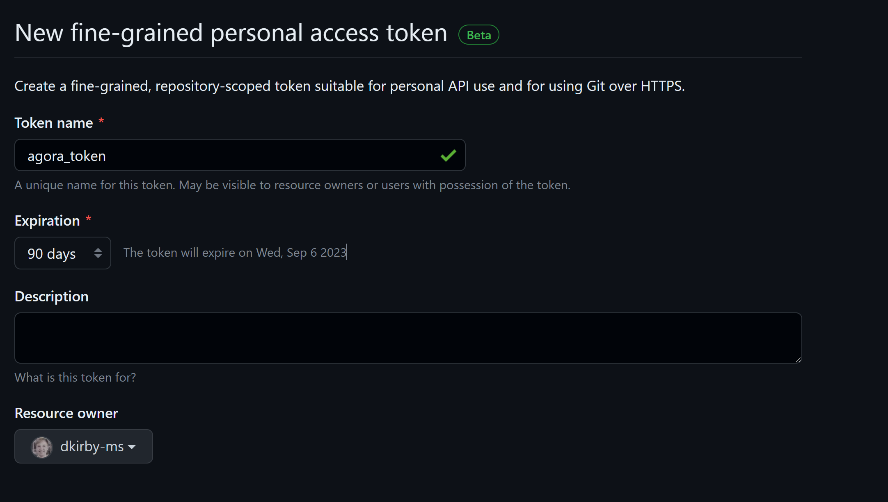

  - Under "Repository access" select "Only select repositories" and then choose the _jumpstart-agora-apps_ repo that you forked in the previous steps.

    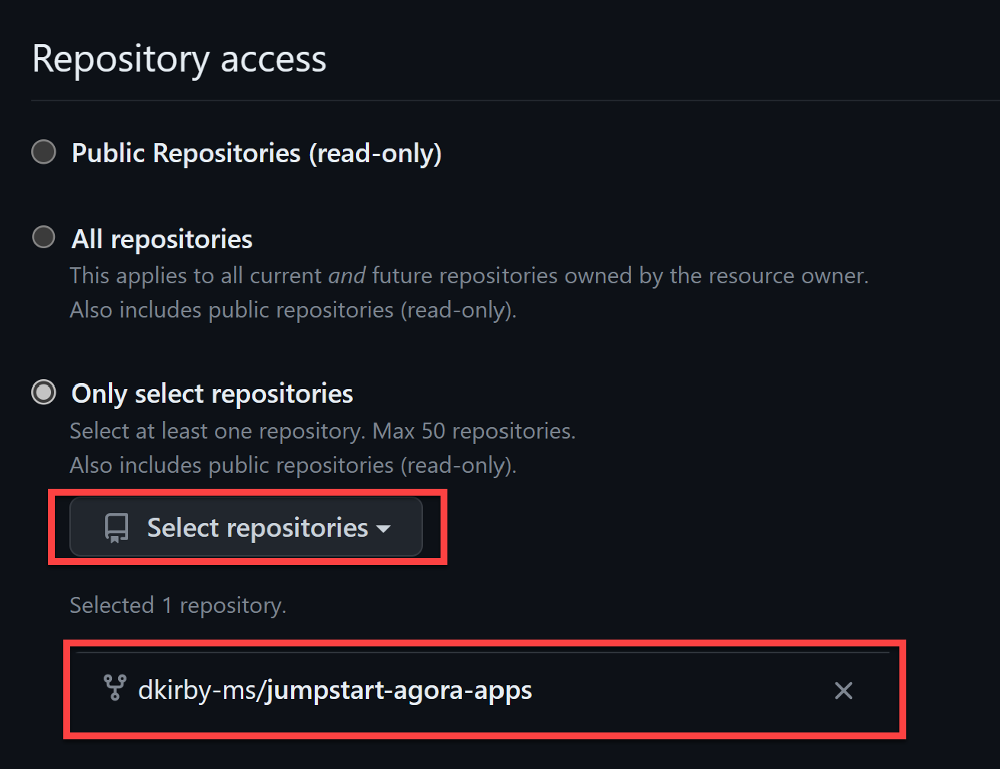

  - Assign the "Read and write" permissions for your fork of the _jumpstart-agora-apps_ repo. The PAT should have read and write permissions for the following operations: Actions, Administration, Contents, Pull Requests, Secrets, and Workflows.

    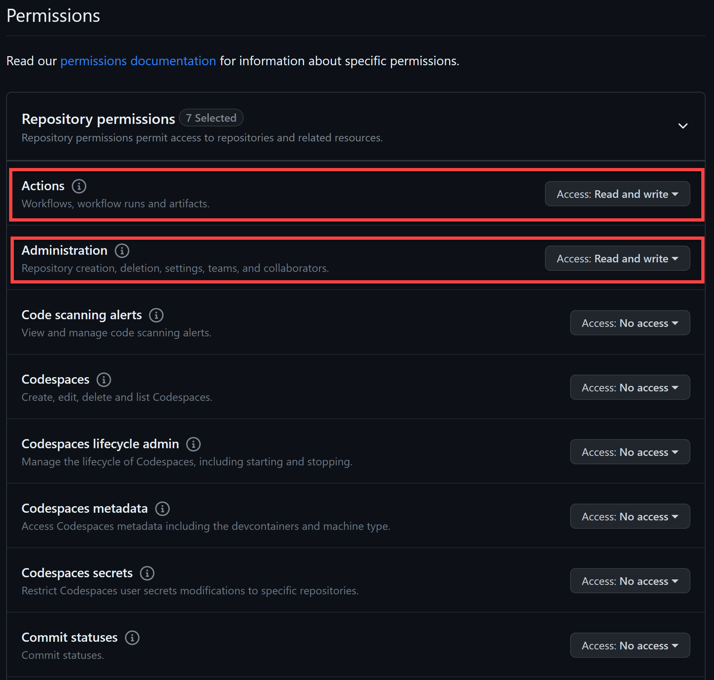

    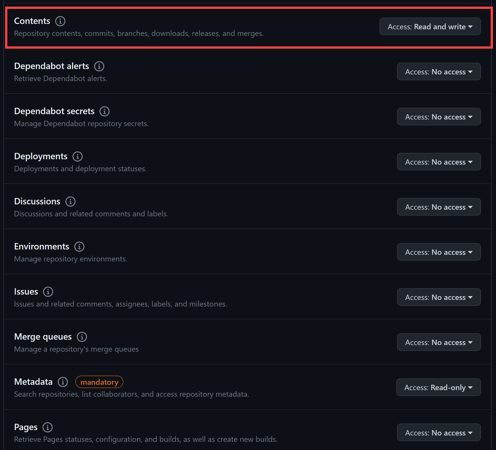

    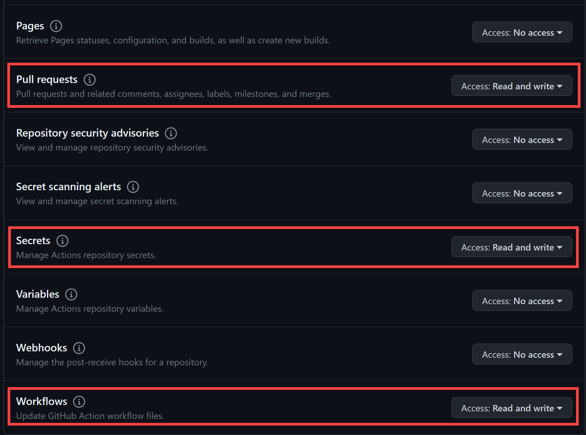

  - Once the correct permissions are assigned click the "Generate token" button.

    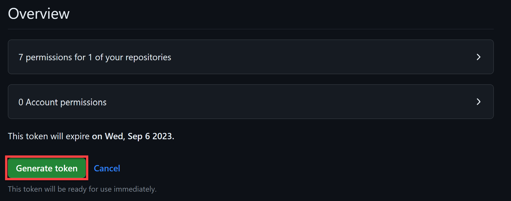

  - Copy the token value to a temporary location such as in Notepad. You will need this value in a later step.

    

    > **NOTE: GitHub fine-grained access tokens are a beta feature of GitHub and may be subject to change in user experience or functionality.**

    > **NOTE: The token shown in the above screenshot is a placeholder value for example purposes only and not a working token.**

- [Install or update Azure CLI to version 2.49.0 or above](https://docs.microsoft.com/cli/azure/install-azure-cli?view=azure-cli-latest). Use the following command to check your current installed version.

    ```shell
    az --version
    ```

- Login to Azure CLI using the ```az login``` command.

- Ensure that you have selected the correct subscription you want to deploy Agora to by using the ```az account list --query "[?isDefault]"``` command. If you need to adjust the active subscription used by Az CLI, follow [this guidance](https://docs.microsoft.com/cli/azure/manage-azure-subscriptions-azure-cli#change-the-active-subscription).

- Agora must be deployed to one of the following regions. **Deploying Agora outside of these regions may result in unexpected results or deployment errors.**

  - East US
  - East US 2
  - Central US
  - West US 2
  - North Europe
  - West Europe

- **Agora requires XXX XXX-series and XXX XXX-series vCPUs**. Ensure you have sufficient vCPU quota available in your Azure subscription and the region where you plan to deploy Agora. You can use the below Az CLI command to check your vCPU utilization.

  ```shell
  az vm list-usage --location <your location> --output table
  ```

  

- Create Azure service principal (SP). An Azure service principal assigned with the _Owner_ Role-based access control (RBAC) role is required. You can use Azure Cloud Shell (or other Bash shell), or PowerShell to create the service principal.

  - (Option 1) Create service principal using [Azure Cloud Shell](https://shell.azure.com/) or Bash shell with Azure CLI:

    ```shell
    az login
    subscriptionId=$(az account show --query id --output tsv)
    az ad sp create-for-rbac -n "<Unique SP Name>" --role "Owner" --scopes /subscriptions/$subscriptionId
    ```

    For example:

    ```shell
    az login
    subscriptionId=$(az account show --query id --output tsv)
    az ad sp create-for-rbac -n "JumpstartAgoraSPN" --role "Owner" --scopes /subscriptions/$subscriptionId
    ```

    Output should look similar to this:

    ```json
    {
    "appId": "XXXXXXXXXXXXXXXXXXXXXXXXXXXX",
    "displayName": "JumpstartAgora",
    "password": "XXXXXXXXXXXXXXXXXXXXXXXXXXXX",
    "tenant": "XXXXXXXXXXXXXXXXXXXXXXXXXXXX"
    }
    ```

  - (Option 2) Create service principal using PowerShell. If necessary, follow [this documentation](https://learn.microsoft.com/powershell/azure/install-az-ps?view=azps-8.3.0) to install Azure PowerShell modules.

    ```PowerShell
    $account = Connect-AzAccount
    $spn = New-AzADServicePrincipal -DisplayName "<Unique SPN name>" -Role "Owner" -Scope "/subscriptions/$($account.Context.Subscription.Id)"
    echo "SPN App id: $($spn.AppId)"
    echo "SPN secret: $($spn.PasswordCredentials.SecretText)"
    ```

    For example:

    ```PowerShell
    $account = Connect-AzAccount
    $spn = New-AzADServicePrincipal -DisplayName "JumpstartAgoraSPN" -Role "Owner" -Scope "/subscriptions/$($account.Context.Subscription.Id)"
    echo "SPN App id: $($spn.AppId)"
    echo "SPN secret: $($spn.PasswordCredentials.SecretText)"
    ```

    Output should look similar to this:

    

    > **NOTE: If you create multiple subsequent role assignments on the same service principal, your client secret (password) will be destroyed and recreated each time. Therefore, make sure you grab the correct secret.**

    > **NOTE: The Jumpstart scenarios are designed with as much ease of use in-mind and adhering to security-related best practices whenever possible. It is optional but highly recommended to scope the service principal to a specific [Azure subscription and resource group](https://docs.microsoft.com/cli/azure/ad/sp?view=azure-cli-latest) as well considering using a [less privileged service principal account](https://docs.microsoft.com/azure/role-based-access-control/best-practices)**

- [Generate a new SSH key pair](https://docs.microsoft.com/azure/virtual-machines/linux/create-ssh-keys-detailed) or use an existing one (Windows 10 and above now comes with a built-in ssh client). The SSH key is used to configure secure access to the Linux virtual machines that are used to run the Kubernetes clusters.

  ```shell
  ssh-keygen -t rsa -b 4096
  ```

  To retrieve the SSH public key after it's been created, depending on your environment, use one of the below methods:
  - In Linux, use the `cat ~/.ssh/id_rsa.pub` command.
  - In Windows (CMD/PowerShell), use the SSH public key file that by default, is located in the _`C:\Users\WINUSER/.ssh/id_rsa.pub`_ folder.

  SSH public key example output:

  ```shell
  ssh-rsa o1djFhyNe5NXyYk7XVF7wOBAAABgQDO/QPJ6IZHujkGRhiI+6s1ngK8V4OK+iBAa15GRQqd7scWgQ1RUSFAAKUxHn2TJPx/Z/IU60aUVmAq/OV9w0RMrZhQkGQz8CHRXc28S156VMPxjk/gRtrVZXfoXMr86W1nRnyZdVwojy2++sqZeP/2c5GoeRbv06NfmHTHYKyXdn0lPALC6i3OLilFEnm46Wo+azmxDuxwi66RNr9iBi6WdIn/zv7tdeE34VAutmsgPMpynt1+vCgChbdZR7uxwi66RNr9iPdMR7gjx3W7dikQEo1djFhyNe5rrejrgjerggjkXyYk7XVF7wOk0t8KYdXvLlIyYyUCk1cOD2P48ArqgfRxPIwepgW78znYuwiEDss6g0qrFKBcl8vtiJE5Vog/EIZP04XpmaVKmAWNCCGFJereRKNFIl7QfSj3ZLT2ZXkXaoLoaMhA71ko6bKBuSq0G5YaMq3stCfyVVSlHs7nzhYsX6aDU6LwM/BTO1c= user@pc
  ```

- Clone the Azure Arc Jumpstart repository

  ```shell
  git clone https://github.com/microsoft/azure_arc.git
  ```

## Deployment: Bicep deployment via Azure CLI

- Upgrade to latest Bicep version

  ```shell
  az bicep upgrade
  ```

- Edit the [main.parameters.json](https://github.com/microsoft/azure_arc/blob/jumpstart_ag/azure_jumpstart_ag/bicep/main.parameters.json) template parameters file and supply some values for your environment.
  - _`sshRSAPublicKey`_ - Your SSH public key
  - _`spnClientId`_ - Your Azure service principal id
  - _`spnClientSecret`_ - Your Azure service principal secret
  - _`spnTenantId`_ - Your Azure tenant id
  - _`windowsAdminUsername`_ - Client Windows VM Administrator name
  - _`windowsAdminPassword`_ - Client Windows VM Password. Password must have 3 of the following: 1 lower case character, 1 upper case character, 1 number, and 1 special character. The value must be between 12 and 123 characters long.
  - _`deployBastion`_ - Option to deploy using Azure Bastion instead of traditional RDP. Set to true or false.
  - _`githubUser`_ - The name of the user account on GitHub where you have forked the [_Jumpstart-Agora-Apps_ repo](https://github.com/microsoft/jumpstart-agora-apps)
  - _`githubPAT`_ - The GitHub PAT token that you created as part of the prerequisites.

  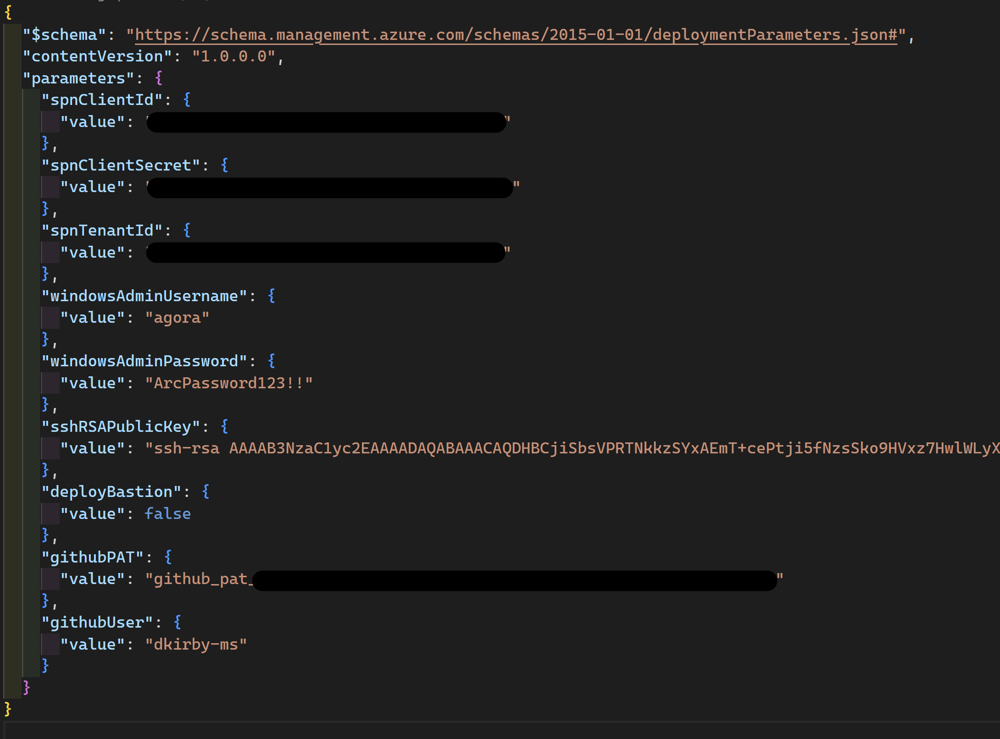

- Now you will deploy the Bicep file. Navigate to the local cloned [deployment folder](https://github.com/microsoft/azure_arc/tree/jumpstart_ag/azure_jumpstart_ag/bicep) and run the below command:

  ```shell
  az login
  az group create --name "<resource-group-name>"  --location "<preferred-location>"
  az deployment group create -g "<resource-group-name>" -f "main.bicep" -p "main.parameters.json"
  ```

    > **NOTE: If you see any failure in the deployment, please check the [troubleshooting guide](https://placeholder).**

## Deployment via Azure Developer CLI (experimental)

Jumpstart Agora provides an experimental feature that allows users to deploy with the [Azure Developer CLI](https://learn.microsoft.com/en-us/azure/developer/azure-developer-cli/overview). Follow these steps to try this experimental feature in your subscription.

- Follow the install guide for the [Azure Developer CLI](https://learn.microsoft.com/en-us/azure/developer/azure-developer-cli/install-azd?tabs=winget-windows%2Cbrew-mac%2Cscript-linux&pivots=os-linux) for your environment.

- Run the ```azd init``` command from your cloned repo _*azure_jumpstart_ag*_ folder.
  
  

- Run the ```azd up``` command to deploy the environment. Azd will prompt you to enter the target subscription, region and all required parameters.

  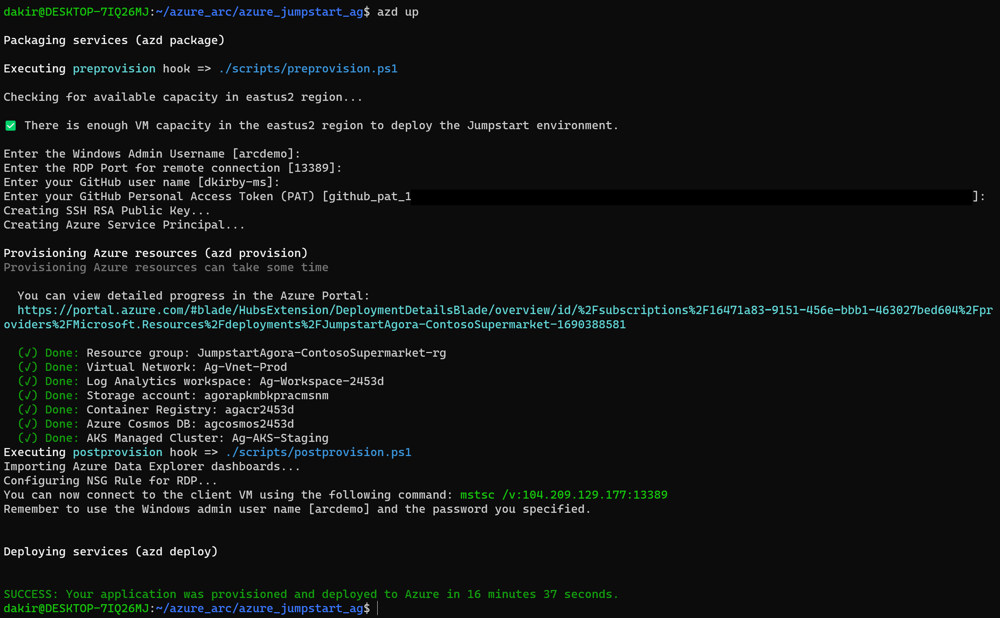

## Start post-deployment automation

Once your deployment is complete, you can open the Azure portal and see the Agora scenario resources inside your resource group. You will be using the _Agora-Client-VM_ Azure virtual machine to explore various capabilities of Agora. You will need to remotely access _Agora-Client-VM_.

  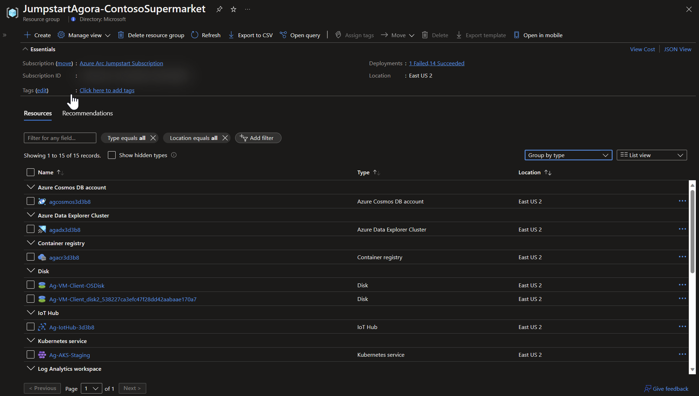

   > **NOTE: For enhanced Agora security posture, RDP (3389) and SSH (22) ports are not open by default in Agora deployments. You will need to create a network security group (NSG) rule to allow network access to port 3389, or use [Azure Bastion](https://docs.microsoft.com/azure/bastion/bastion-overview) or [Just-in-Time (JIT)](https://docs.microsoft.com/azure/defender-for-cloud/just-in-time-access-usage?tabs=jit-config-asc%2Cjit-request-asc) access to connect to the VM.**

### Connecting to the Agora Client virtual machine

Various options are available to connect to _Agora-Client-VM_, depending on the parameters you supplied during deployment.

- [RDP](https://placeholder) - available after configuring access to port 3389 on the _Agora-NSG-Prod_, or by enabling [Just-in-Time access (JIT)](https://placeholder).
- [Azure Bastion](https://placeholder) - available if ```true``` was the value of your _`deployBastion`_ parameter during deployment.

#### Connecting directly with RDP

By design, Agora does not open port 3389 on the network security group. Therefore, you must create an NSG rule to allow inbound 3389.

- Open the _Agora-NSG-Prod_ resource in Azure portal and click "Add" to add a new rule.

  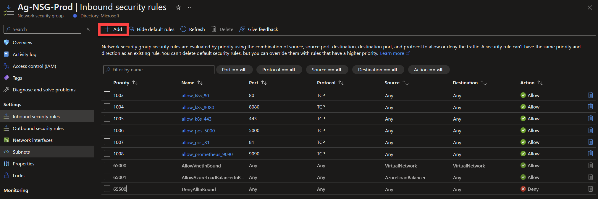

- Select My IP address from the dropdown.

  

  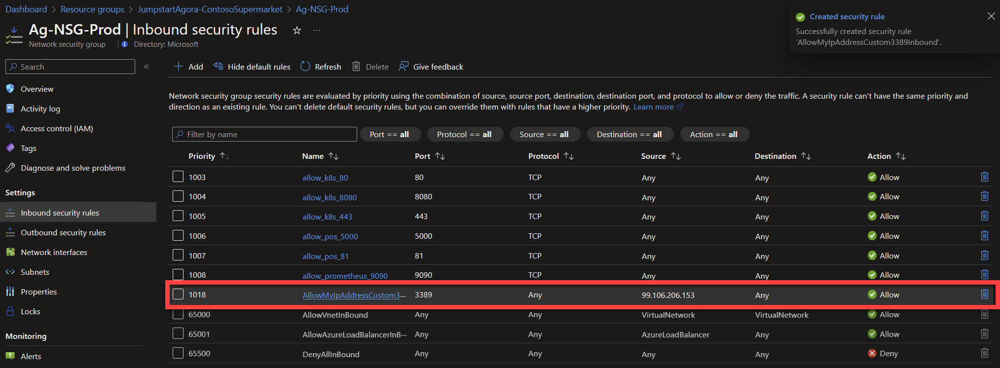

  

#### Connect using Azure Bastion

- If you have chosen to deploy Azure Bastion in your deployment, use it to connect to the VM.

  

  > **NOTE: When using Azure Bastion, the desktop background image is not visible. Therefore some screenshots in this guide may not exactly match your experience if you are connecting to _Agora-Client-VM_ with Azure Bastion.**

#### Connect using just-in-time access (JIT)

If you already have [Microsoft Defender for Cloud](https://docs.microsoft.com/azure/defender-for-cloud/just-in-time-access-usage?tabs=jit-config-asc%2Cjit-request-asc) enabled on your subscription and would like to use JIT to access the Client VM, use the following steps:

- In the Client VM configuration pane, enable just-in-time. This will enable the default settings.

  

  

  

### The Logon scripts

- Once you log into the _Agora-Client-VM_, multiple automated scripts will open and start running. These scripts usually take around thirty minutes to finish, and once completed, the script windows will close automatically. At this point, the deployment is complete.

  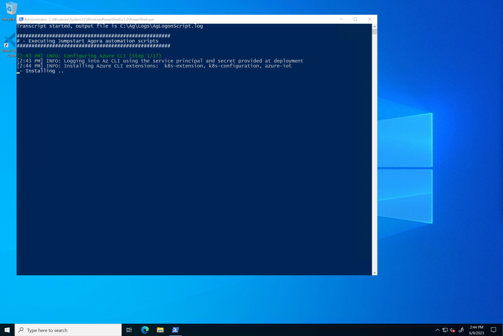

- Deployment is complete! Let's begin exploring the features of Contoso Supermarket!

  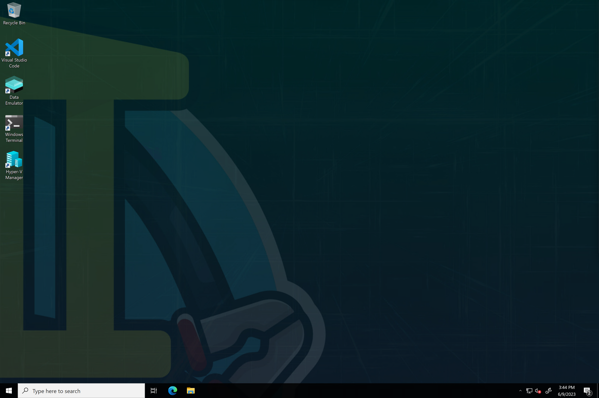

  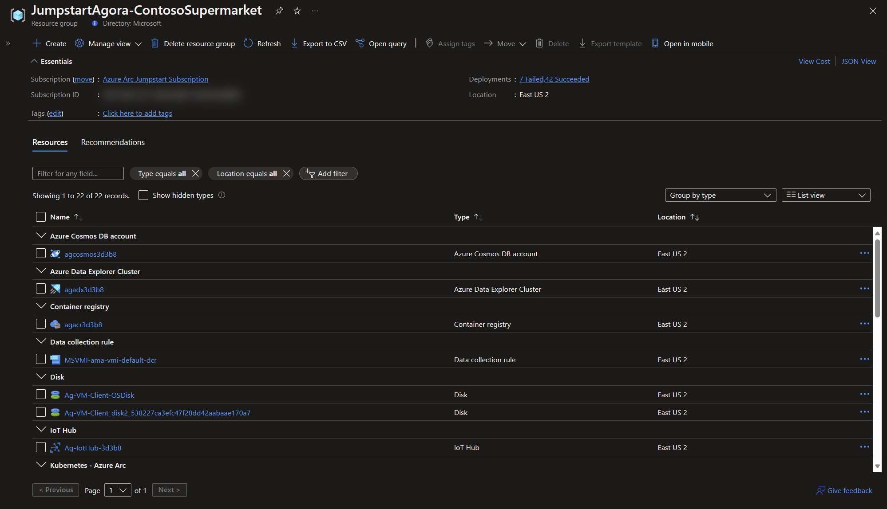

## Next steps

Once deployment is complete its time to start experience Agora capabilities. Use the following guides to explore the use cases of Contoso Supermarket in Jumpstart Agora.

- [POS](https://placeholder)
- [Freezer Monitor](https://placeholder)
- [CI/CD](https://placeholder)
- [Basic GitOps](https://placeholder)
- [Analytics](https://analytics)
- [Troubleshooting](https://troubleshooting)

## Clean up the deployment

To clean up your deployment, simply delete the resource group using Azure CLI or Azure portal. If you used Azure Developer CLI to deploy then ```azd down``` can be used instead. 

```shell
az group delete -n <name of your resource group>
```


