# Jumpstart HCIBox - Windows Admin Center operations

## Using Windows Admin Center

HCIBox includes multiple methods of exploring Windows Admin Center (WAC). Windows Admin Center is available from inside the Azure portal, and a deployment of [Windows Admin Center as a gateway server](https://learn.microsoft.com/windows-server/manage/windows-admin-center/plan/installation-options) is also available. A shortcut to the Windows Admin Center gateway server is available on the _HCIBox-Client_ desktop.

### Windows Admin Center in Azure portal

Windows Admin Center can be used directly from the Azure portal. To set this up for your HCIBox cluster, follow these steps:

- Navigate to the _HCIBox-Cluster_ resource and select the Windows Admin Center blade.

  

- Leave the port set to the default value and click Install. Installation will take a few minutes to complete.

  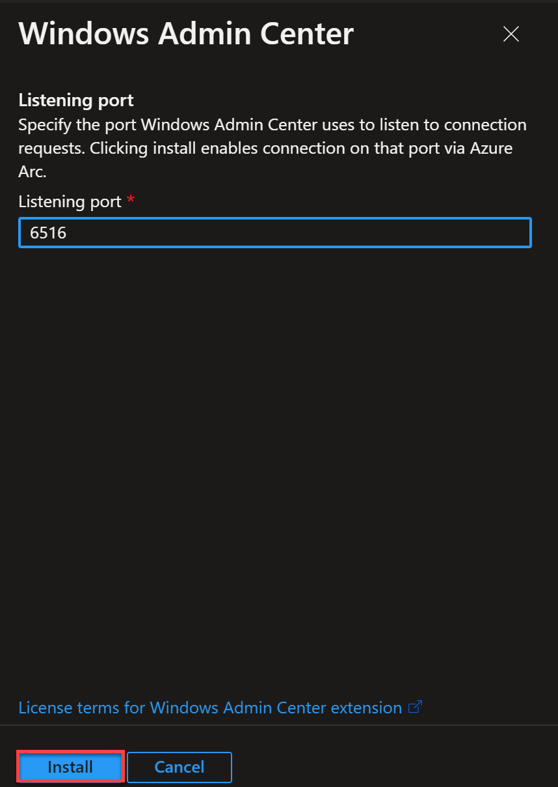

- Once installation is complete, click Connect from the Windows Admin Center blade on the cluster resource.

  

- Connecting to Windows Admin Center requires using the domain account credential. Connect with your domain account as shown in the screenshot below.

  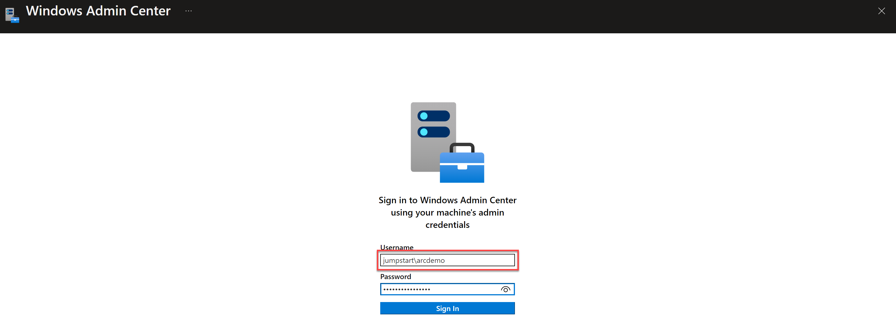

- You can now explore your cluster using Windows Admin Center in Azure portal.

  

### Windows Admin Center gateway server

HCIBox also includes a dedicated Windows Admin Center (WAC) gateway server. The WAC gateway server can be accessed by connecting to it from RDP. A shortcut is available on the _HCIBox-Client_ desktop.

  > __NOTE: [Registering Windows Admin Center with Azure](https://learn.microsoft.com/en-us/azure-stack/hci/manage/register-windows-admin-center) is not supported in HCIBox.__

- Open this shortcut and use the domain credential (username_supplied_at_deployment@jumpstart.local) to start an RDP session to the Windows Admin Center VM.

  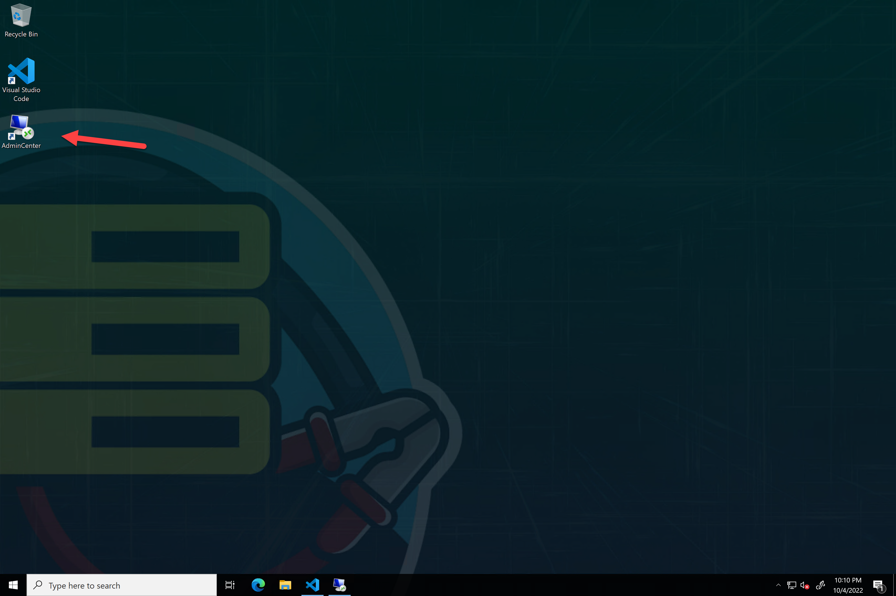

- Log in to the WAC gateway server using the domain credential.

  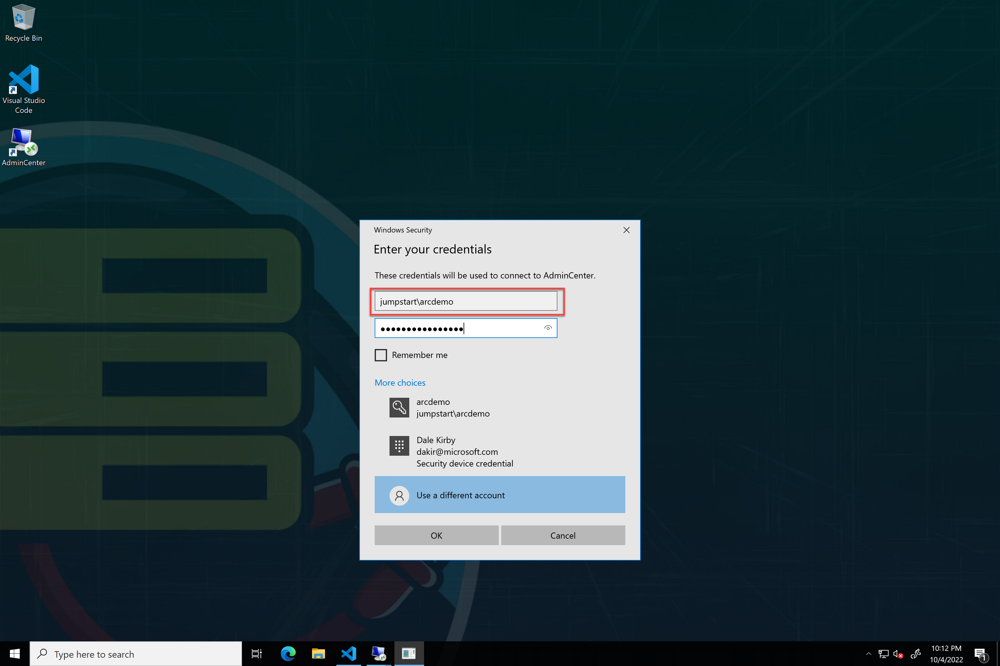

- Now you can open the Windows Admin Center shortcut on the WAC server desktop. Once again you will use your domain account to access WAC.

  

  

- Now that we are logged in, our first step is to add a connection to our HCI cluster. Click on the "Add" button, and then click on "Add" under "Server clusters".

  

  

- Enter "_hciboxcluster_" for the cluster name, and use the domain account credential to connect to the cluster.

  

  

- Now that the cluster is added, we can explore management capabilities for the cluster inside of WAC. Click on the cluster to drill into its details.

  

  

- If you followed the steps to [deploy a VM from Azure portal](https://azurearcjumpstart.io/azure_jumpstart_hcibox/RB/_index.md), click on the Virtual Machines.

  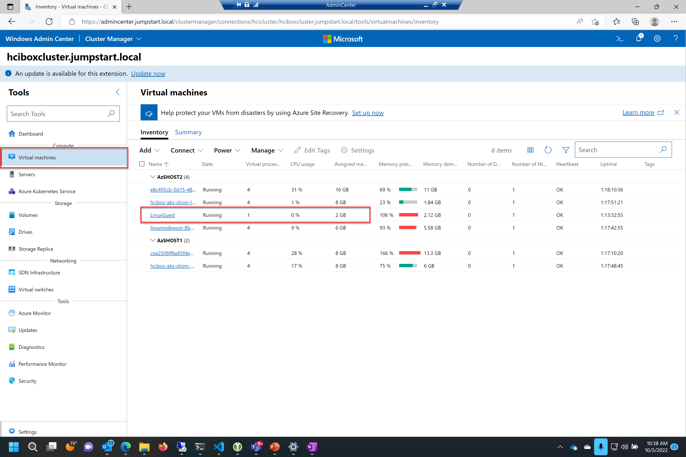

- Windows Admin Center also provides the ability to connect directly to the VM. Click on the VM name and then click the "Connect" dropdown and click "Connect" to login to the VM using the domain credential. Click the checkbox to automatically use the certificate presented by the machine before clicking "Connect" again to connect.

  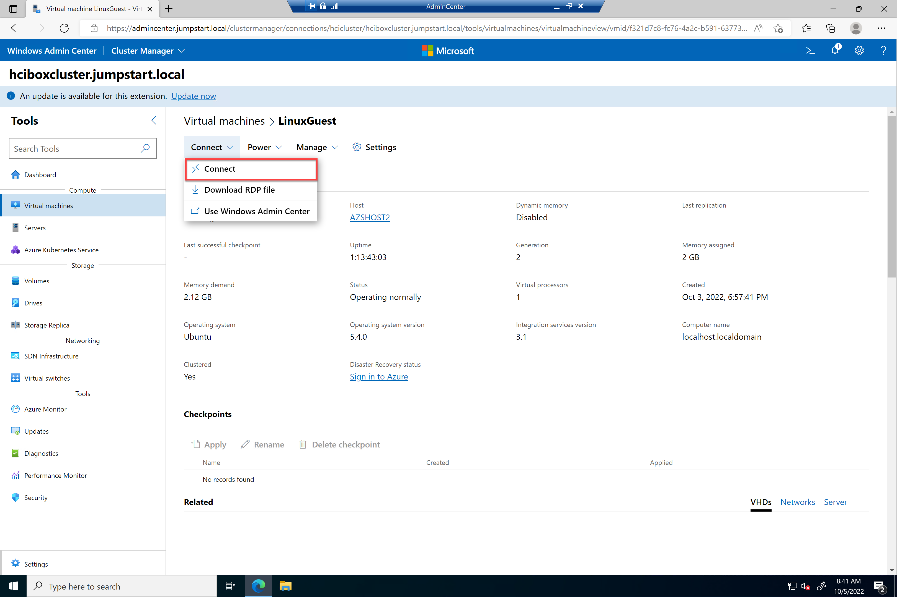

  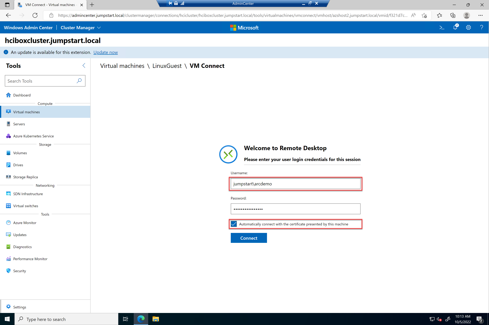

  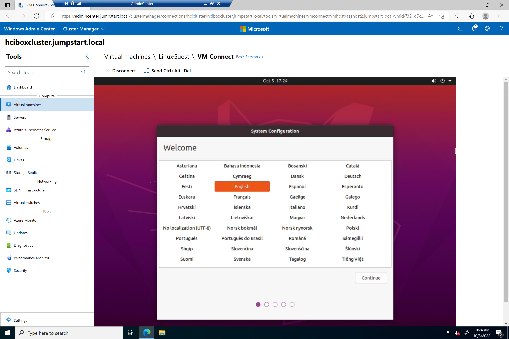

- We can also seamlessly move the VM from one cluster node to another using [live migration](https://learn.microsoft.com/windows-server/virtualization/hyper-v/manage/live-migration-overview).

- In the example below, we can see the LinuxGuest virtual machine is hosted on _AzSHOST2_.

  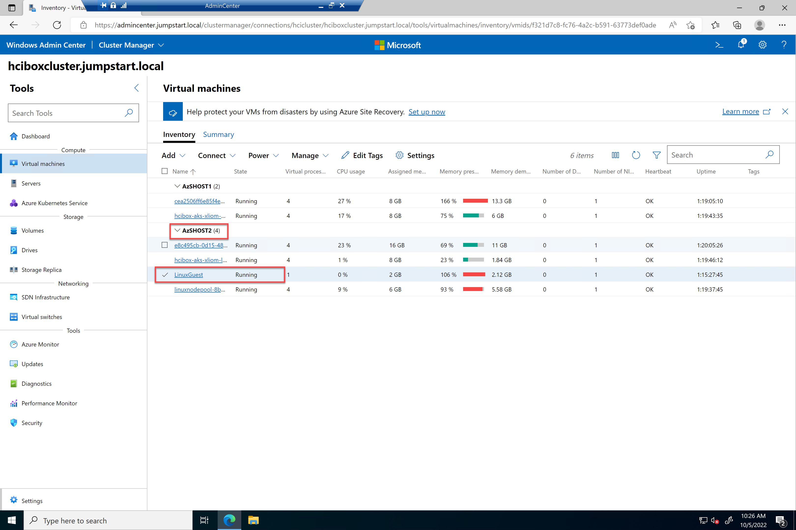

- Click the "Manage" dropdown and then click "Move".

  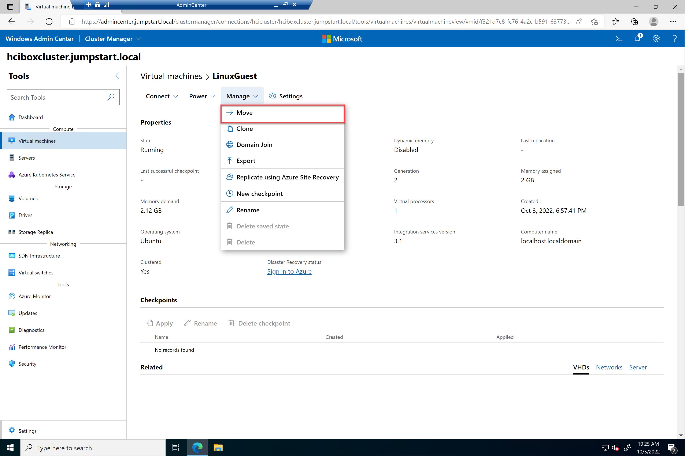

- In the Move dialog, leave the default settings and click "Move" to start the live migration.

  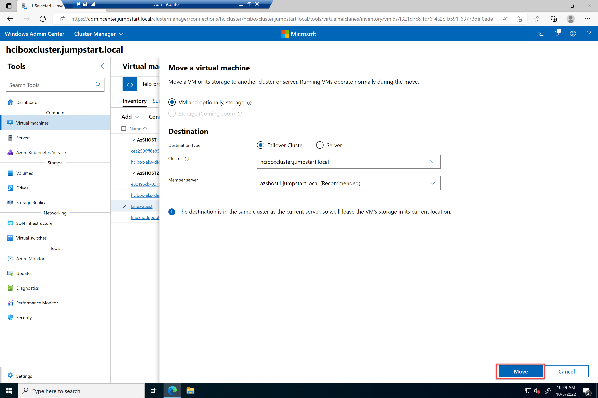

- The migrated virtual machine is now hosted on _AzSHOST2_.

  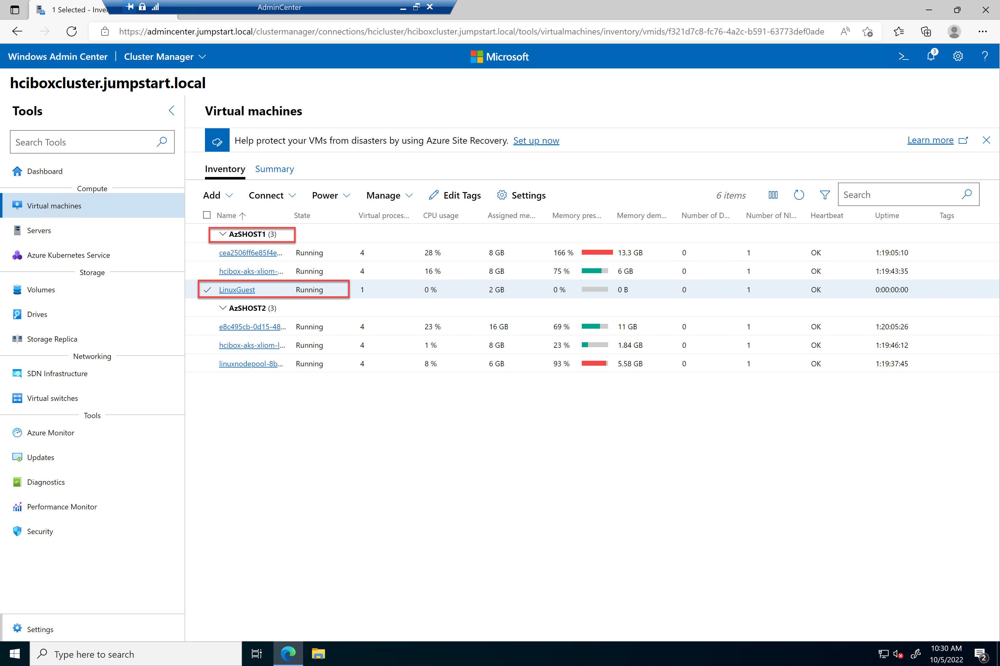

### Next steps

For additional Windows Admin Center operations, review the [official documentation](https://learn.microsoft.com/windows-server/manage/windows-admin-center/overview).
